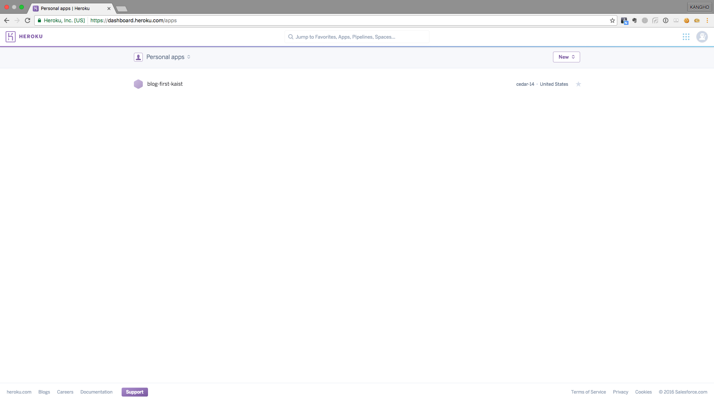
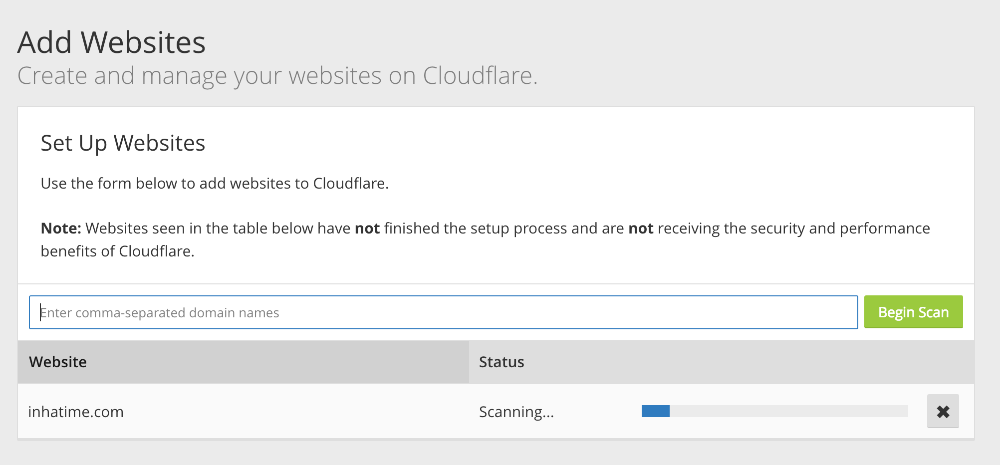
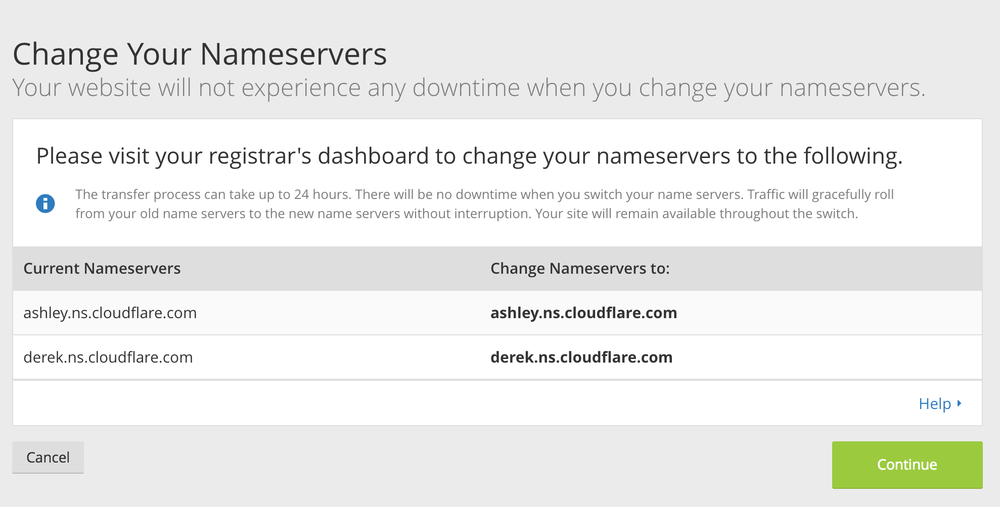
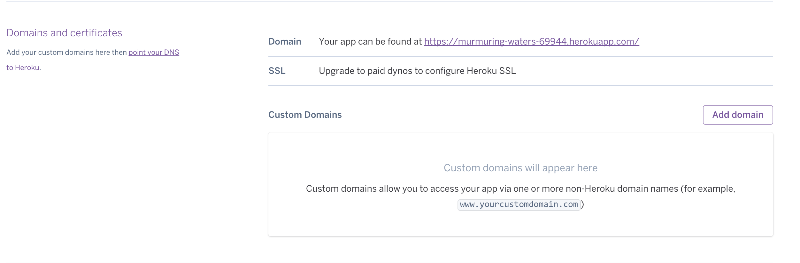
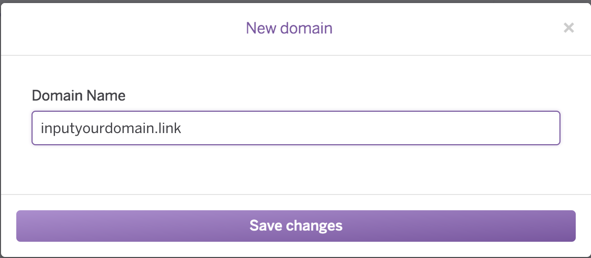

# Heroku Deploy

Heroku를 사용해서 지금까지 만든 블로그를 디플로이 하도록 하자. 일단 [Heroku](https://dashboard.heroku.com/)에 가입해야 한다.



Heroku에 가입을 한다음 CLI를 설치해야 하는데 c9에서는 이미 CLI가 설치된 상태라 편하게 시작 할 수 있다.

```
$ cannalee:~/workspace (08_heroku_deploy) $ heroku
Enter your Heroku credentials.
Email: cannalee90@gmail.com
Password (typing will be hidden):
Logged in as cannalee90@gmail.com
 ▸    Add apps to this dashboard by favoriting them with heroku apps:favorites:add
See all add-ons with heroku addons
See all apps with heroku apps --all

See other CLI commands with heroku help
```

```
$heroku create
Creating app... done, ⬢ blooming-sierra-58111
https://blooming-sierra-58111.herokuapp.com/ | https://git.heroku.com/blooming-sierra-58111.git
```

그리고 디플로이를 위해서 gemfile을 수정해보자

```
group :production do
  gem 'pg'
  gem 'rails_12factor'
end

```


```
$git push heroku master
```

이때 **master** 브랜치가 아니면 제대로 디플로이가 되지 않으니 주의해야 한다.

이제 production 데이터베이스가 제대로 돌아갈 수 있도록 migrate을 수행해야 한다. 다음과 같은 명령어로 수행한다

```
$ heroku run rake db:migrate
```

이제 우리가 디플로이한 사이트를 방문해 보자. 아래의 명령어로 확인이 가능하다. 제대로 디플로이가 되서 어플리케이션이 실행되고 잇다면 다음과 같은 창이 보이게 된다.

```
$ heroku ps
Free dyno hours quota remaining this month: 550h 0m (100%)
For more information on dyno sleeping and how to upgrade, see:
https://devcenter.heroku.com/articles/dyno-sleeping

=== web (Free): bin/rails server -p $PORT -e $RAILS_ENV (1)
web.1: up 2016/09/23 08:29:36 +0000 (~ 11m ago)
```

이제 주소를 통해 접속이 가능하다.

기본적으로 heroku는 550시간의 무료 시간만을 제공하지만 한달을 사용하기위해서는 약간 부족한 시간이다. 하지만 신용카드를 사용해서 등록하게 되면 450시간의 추가 시간이 주어진다.

```
$ heroku ps -a blooming-sierra-58111
Free dyno hours quota remaining this month: 550h 0m (100%)
For more information on dyno sleeping and how to upgrade, see:
https://devcenter.heroku.com/articles/dyno-sleeping
```

[이곳](https://devcenter.heroku.com/articles/account-verification)을 참고해서 account-verification을 진행하도록 하자.


```
heroku ps -a blooming-sierra-58111
Free dyno hours quota remaining this month: 1000h 0m (100%)
For more information on dyno sleeping and how to upgrade, see:
https://devcenter.heroku.com/articles/dyno-sleeping

=== web (Free): bin/rails server -p $PORT -e $RAILS_ENV (1)
web.1: up 2016/09/23 08:29:36 +0000 (~ 38m ago)
```

verification을 진행하면 사용할 수 있는 시간이 천시간으로 되었다. free-dyno(돈을 내지 않고 무료로 사용하는 상태)의 경우 30분동안 트래픽이 들어오지 않으면 sleep상태로 바뀌게 된다. 이때 새로운 트래픽이 들어오면 잠깐에 딜레이 후 다시 상태가 바뀌게 된다.

헤로쿠 dyno에 대해서는 [여기](https://devcenter.heroku.com/articles/dyno-types)에 정리되어 있다.

------

지금 서버는 web-brick으로 돌아가고 있는 상태이다. web-sever를 바꾸기 위해서는 다음과 진행한다.

```
gemfile
gem 'puma'

$bundle install
```

---

cloudflare를 사용해서 dns setting을 해야한다.

- [cloudflare](https://www.cloudflare.com/) 가입



아마 처음 회원가입했을 경우 다른 화면이이 나오겠지만, 기본적으로 원하는 웹사이트 주소를 스캔하는 시간을 가진 다음 도메인은 연결 할 수 있다.


다음과 같이 select 메뉴에서 cname을 선택하고 도메인 이름 그리고 heroku app으로 접속할 수 있는 주소를 적어준 다음 add record를 누르면 된다. 주의할 점은 URI를 바로 주소창에서 복사할 경우 처음에는 `https://`와 마지막에 `/` 같은 문자들이 들어가게 되는데 이를 지워줘야지 add record가 가능하다.

select plan에서는 free를 선택한다.



우리가 구입한 도메인이 cloudflare에서 제공하는 네임서버를 사용할 수 있도록 셋팅해야 한다. 만약 따로 도메인을 구입했다면 도메인을 구입한 사이트에서 오른쪽에 있는 네임서버로 변경한다. 본 수업에서는 구글 스프레이드 시트에 변경될 nameserver를 적어주시면 조교분들이 일괄적으로 변경해드립니다.





DNS셋팅을 마치고 난 후에는 heroku에 custom domain셋팅을 해야한다. 만약 account-verification를 진행하지 않았다면 [이곳](https://devcenter.heroku.com/articles/account-verification)을 클릭해서 인증을 진행한다.
